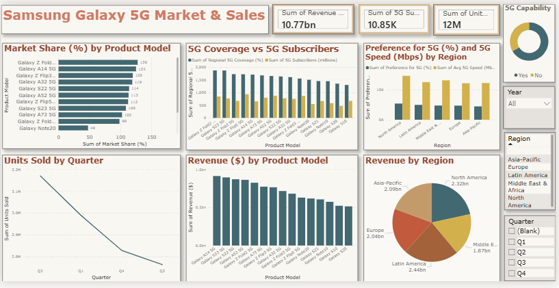

 📊 README: Samsung Galaxy 5G Market & Sales Dashboard (Power BI)
 🧩 Overview
This Power BI dashboard provides a comprehensive analysis of **Samsung Galaxy 5G smartphone market performance**, combining product-level, regional, and temporal insights. It helps stakeholders understand sales trends, revenue distribution, 5G adoption, and regional preferences.

---
## 📁 Data Sources
- **Product Model Data:** Galaxy 5G series (Fold, Flip, S, A, Note models)
- **Regional Data:** Asia-Pacific, Europe, Latin America, Middle East & Africa, North America
- **Metrics:** Revenue, Units Sold, Market Share, 5G Coverage, 5G Subscribers, Speed Preferences

---

## 📈 Dashboard Components

| Section | Visualization Type | Description |
|----------|--------------------|--------------|
| **Market Share (%) by Product Model** | Bar Chart | Compares market share across Galaxy 5G models. Highlights top performers like Galaxy Z Fold4 5G and Galaxy A14 5G. |
| **5G Coverage vs 5G Subscribers** | Clustered Bar Chart | Shows correlation between regional 5G coverage and subscriber count per model. |
| **Preference for 5G (%) and Speed (Mbps) by Region** | Bar Chart | Displays regional 5G preference and average speed, useful for network performance analysis. |
| **Units Sold by Quarter** | Line Chart | Tracks quarterly sales trends, showing a decline from Q1 to Q4. |
| **Revenue ($) by Product Model** | Bar Chart | Highlights revenue contribution per model, identifying high-value devices. |
| **Revenue by Region** | Pie Chart | Visualizes revenue distribution across regions, with Latin America and Asia-Pacific leading. |

---

## 🧮 Key Metrics

- **Total Revenue:** 10.77 billion USD  

- **Total 5G Subscribers:** 10.85K  

- **Total Units Sold:** 12 million  

---

## 🎯 Filters and Interactivity

- **Year Filter:** Enables year-wise comparison.  

- **Region Filter:** Allows focus on specific geographic markets.  

- **Quarter Filter:** Supports temporal trend analysis.  

- **5G Capability Toggle:** Differentiates between 5G-enabled and non-5G models.

---

## 🧠 Insights

- Galaxy Z Fold4 5G and A14 5G dominate both revenue and market share.

- Latin America shows the highest regional revenue, followed by Asia-Pacific.

- Quarterly sales decline suggests seasonal or market saturation effects.

- 5G adoption and speed preferences vary significantly by region.

---

## 🛠️ Technical Notes

- **Tool:** Microsoft Power BI  

- **Data Model:** Star schema with fact tables (Sales, Revenue) and dimension tables (Product, Region, Time, 5G Capability).  

- **Refresh Schedule:** Recommended monthly to maintain data accuracy.  

- **File Format:** `.pbix` (Power BI Desktop)  

---

## 📄 Usage Instructions

1. Open the `.pbix` file in Power BI Desktop.  

2. Connect to the dataset or refresh data sources.  

3. Use filters to explore specific regions, quarters, or product models.  

4. Export visuals or insights as PDF or PowerPoint for reporting.

Dashboard Screenshot:

"Certain materials, including logos and images, 
are included in this educational data analytics 
dashboard under the fair use provision of the Indian Copyright Act, 1957. 
These materials are used strictly for educational, non-commercial purposes. 
All copyrights and trademarks remain the property of their respective owners."

